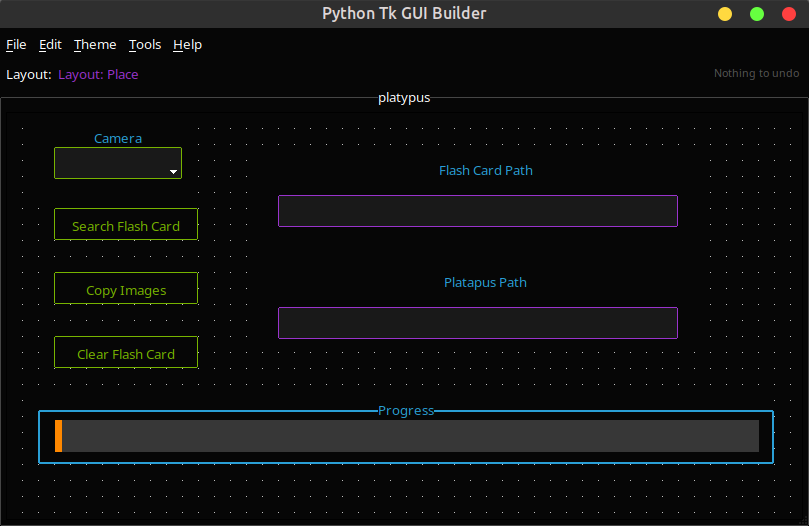
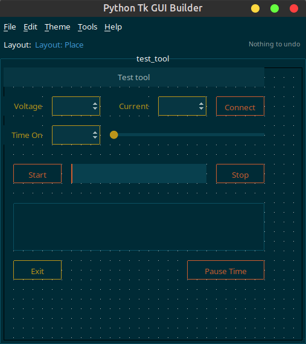

# PyTkQuickGui

PyTkQuickGui is a visual drag-and-drop builder for Python desktop interfaces
using tkinter and ttkbootstrap. Design a window on the live canvas, edit widget
attributes and layout, save the project as JSON, then generate a readable Python
program.

The project is approaching beta. Grid and Place projects are usable and under
active testing; Pack remains disabled while the other two geometry managers are
stabilised.

## Screenshots

| Place layout | Instrument-style project |
|---|---|
|  |  |

## What it does

- Builds ttkbootstrap interfaces visually on a live design surface.
- Uses responsive Grid layout by default, or free-form Place layout.
- Moves, resizes, duplicates, deep-clones, deletes, groups, and re-parents
  widgets.
- Edits widget attributes with colour, font, image, entry, combo, and spinbox
  controls.
- Gives Grid and Place widgets useful type-specific layout defaults.
- Keeps child layouts inside Frame, Labelframe, and Panedwindow containers.
- Saves human-readable JSON projects with atomic writes and rolling backups.
- Preserves design-time callback and Tk-variable names through save, reload,
  duplication, and code generation.
- Generates clean multiline Python calls and preserves callback bodies edited
  in a previously generated file.
- Supports undo and redo for the main editing operations.
- Applies ttkbootstrap themes to the builder and generated program.

## Requirements

- Python 3.10 or newer
- tkinter (sometimes supplied as a separate operating-system package)
- ttkbootstrap 2.0 or newer
- tkfontchooser
- coloredlogs
- Pillow

The complete Python dependency list is in
[`requirments.txt`](requirments.txt). The filename is retained for compatibility
with existing setup instructions.

On Debian or Ubuntu, install tkinter if it is not already present:

```bash
sudo apt install python3-tk
```

## Installation

```bash
git clone https://github.com/ChrisMcGowanAu/PyTkQuickGui.git
cd PyTkQuickGui

python -m venv .venv
source .venv/bin/activate
pip install -r requirments.txt

python pytkquickgui.py
```

On Windows, activate the environment with:

```powershell
.venv\Scripts\activate
```

## Quick start

1. Run `python pytkquickgui.py`.
2. Select **File → New Project**, enter a project name, and choose Grid or
   Place.
3. Right-click the design surface and choose a widget.
4. Drag the widget to move it. In Place mode, drag an edge to resize it.
   In Grid mode, movement changes its row and column and edge drags adjust its
   span.
5. Right-click the widget and use **Edit** for attributes or **Layout** for
   geometry.
6. Use **File → Save Project** to save the JSON project.
7. Use **File → Trial Run** to preview it or **File → Generate Python** to
   write a program.

## Interface

The top toolbar shows the active layout manager. Grid projects also expose:

- **Rows** and **Cols** controls for the root design grid.
- **Grid settings** for guide colour, row and column minimum sizes, padding,
  and saving the current settings as tool defaults.
- An undo status at the right.

The geometry manager is selected for the project. Once widgets exist, switching
manager is blocked because mixing managers in one Tk parent leads to invalid
layouts. Start a new project to use a different manager.

### Main menus

| Menu | Important actions |
|---|---|
| File | New, open, close, save, save as, Trial Run, Generate Python |
| Edit | Undo, redo, group selected widgets, ungroup |
| Theme | Light, dark, and legacy ttkbootstrap themes |
| Tools | Label borders, default fonts/styles, backups, widget tree, Compact Grid |
| Help | Welcome and the in-application guide |

## Working with widgets

Right-click empty space to open the widget palette. The current palette contains
these container widgets:

- Frame
- Labelframe
- Panedwindow

These regular widgets are currently enabled:

- Label
- Button
- Entry
- Combobox
- Spinbox
- Checkbutton
- Radiobutton
- Scale
- Progressbar
- Canvas
- Text
- Listbox
- Separator

Other Tk and ttkbootstrap widget implementations remain in the source while
their designer behaviour is completed, but they are not offered in the palette.

### Widget context menu

| Action | Result |
|---|---|
| Edit | Opens the scrollable attribute editor |
| Layout | Opens geometry values for the current manager |
| Duplicate | Copies one widget |
| Clone | Deep-copies a container and its children |
| Re-Parent | Places the widget in the enclosing container, or back at the root |
| Delete | Removes the widget |
| Add to Selection | Adds the widget to the current multi-selection |
| Group Selected | Creates a logical group from selected widgets |

The Edit and Layout popups put the action buttons at both the top and bottom.
The duplicate controls are intentional: short forms remain convenient while
long forms do not force the user to scroll to a particular end. Popups can be
moved with the yellow drag handle.

The attribute editor stores callback fields such as `command` and variable
fields such as `textvariable` as Python names, rather than trusting Tk's
internal Tcl command strings. Use valid top-level Python identifiers for these
values, for example `save_record` or `customer_name`.

## Geometry managers

### Grid

Grid is the default and is recommended for responsive forms. Widgets use
`row`, `column`, `columnspan`, `rowspan`, `padx`, `pady`, `ipadx`, `ipady`, and
`sticky`.

New widgets receive type-specific defaults. For example, entries span more
columns than labels, while text areas and containers span several rows and
columns. Open a widget's **Layout** popup and select **Save default** to make
its current Grid layout the default for future widgets of that type.

Rows and columns expand with the design surface. Container widgets keep their
own internal grid dimensions, including extra tracks created while editing.
Those dimensions are stored in the project and reproduced in Trial Run and
generated Python.

Use **Tools → Compact Grid** to remove unoccupied gaps and reduce the configured
root grid to its occupied extent.

Example generated geometry:

```python
Widget0.grid(
    row=2,
    column=1,
    columnspan=3,
    rowspan=1,
    sticky="nsew",
    padx=2,
    pady=2,
)
```

### Place

Place is useful for free-form prototypes and fixed-position controls. It stores
`x`, `y`, `width`, and `height`.

The drop position always follows the pointer. Initial `width` and `height` are
type-specific: containers and text areas start larger than buttons and labels.
Resize a widget, open **Layout**, and select **Save default** to use that size
for future widgets of the same type.

Example generated geometry:

```python
Widget0.place(
    x=80,
    y=48,
    width=180,
    height=32,
    anchor="nw",
    bordermode="inside",
)
```

### Pack

Pack is disabled for new projects. Compatibility code remains for older project
files, but its visual editing model is deferred until Grid and Place are stable.

## Tool defaults

`tool_defaults.py` contains the built-in Grid and Place defaults. Optional
`tool_defaults.json` files are layered in this order, from lowest to highest
precedence:

1. `/etc/pytkgui/tool_defaults.json`
2. `tool_defaults.json` beside the PyTkQuickGui source modules
3. `tool_defaults.json` in the directory from which the tool was launched
4. The user's configuration file

The user file is normally:

- Linux: `~/.config/pytkgui/tool_defaults.json`
- Linux with `XDG_CONFIG_HOME`: `$XDG_CONFIG_HOME/pytkgui/tool_defaults.json`
- Windows: `%APPDATA%\pytkgui\tool_defaults.json`

Missing files are ignored. Files may contain only the values they need to
override; nested widget defaults are merged field by field. The user file has
highest priority so **Save as tool default** and **Save default** take effect
without modifying a system or source installation.

The top-level Grid settings are:

```json
{
  "gridRows": 25,
  "gridCols": 25,
  "gridLineColor": "",
  "gridRowMinsize": "2.5m",
  "gridColMinsize": "5m",
  "gridRowPad": "2.5m",
  "gridColPad": "5m"
}
```

Per-widget records live under `gridWidgetDefaults` and
`placeWidgetDefaults`. Place records contain only `width` and `height`.

Grid rows, columns, guide colour, minimum sizes, and padding are also saved in
each project. Project values override tool defaults when that project is
opened; tool defaults remain the starting values for new projects.

## Project files

New projects are stored below the platform configuration directory, normally:

```text
~/.config/pytkgui/MyProject/
```

The active file is `MyProject.json`. Each save is written to a temporary file,
parsed for validation, and atomically replaces the active file. Up to five
earlier versions are rotated as:

```text
MyProject-save1.json
MyProject-save2.json
...
MyProject-save5.json
```

**Tools → Open backup file** can load a saved backup.

Project JSON includes:

- project name, theme, and geometry manager
- window and Grid settings
- widget identity and creation order
- parent/child relationships
- Place or Grid geometry
- container Grid dimensions
- editable widget attributes
- callback and Tk-variable design names
- image references and logical groups
- the last generated Python path, when available

Older `.pk1` pickle projects can still be detected and opened. Because pickle
can execute code while loading, open legacy files only when you trust their
source. The next save writes the project in JSON format.

## Generating Python

**File → Generate Python** proposes `<project-name>.py` in the last output
directory. Widget constructors and geometry calls are formatted one argument
per line:

```python
Widget1 = ttk.Frame(
    rootWidget,
    width="0",
    height="0",
    cursor="arrow",
    style="primary.TFrame",
)
```

The generated file contains marked sections for Tk variables, callback
functions, widgets, and the main program. Callback names referenced by widgets
receive an initial stub:

```python
def save_record():
    # AUTO-GENERATED STUB
    print("save_record")
```

When the same generated file is selected again, PyTkQuickGui preserves edited
callback bodies and customised Tk-variable initialisers. Widget construction
and geometry sections are rebuilt from the current project. User functions no
longer referenced by a widget are also retained.

**Trial Run** writes and launches a temporary generated file. It is intended for
layout testing and does not replace the explicitly saved Python file.

## Themes

The Theme menu groups ttkbootstrap 2.0 light and dark themes and retains legacy
theme names for older projects. The selected theme is stored in the project and
used by generated Python.

Changing a theme can alter requested widget sizes. Grid layouts normally absorb
those differences; check a Trial Run when exact Place dimensions matter.

## Troubleshooting

- If a project JSON was hand-edited, validate its JSON syntax first.
- If a generated callback is skipped, check that its name is a valid Python
  identifier and not a Python keyword.
- If Grid guides appear stale after resizing, resize the main window once and
  report the project JSON and steps needed to reproduce it.
- Use the most recent `-saveN.json` backup if an active project file is damaged.
- Runtime detail is written through Python logging. Benign Tk lookups on a
  widget already destroyed during cleanup are logged at debug level.

## Current limitations

- Pack cannot be selected for a new project.
- The palette deliberately exposes a smaller widget set while remaining widgets
  are stabilised.
- Some complex widgets require application-specific setup that a visual builder
  cannot infer, such as connecting scrollbars to targets.
- Trial Run and visual editing require a desktop session with Tk support.
- Legacy pickle compatibility is temporary and should be treated as a migration
  path to JSON.

## Development and testing

Run the unit tests from the repository root:

```bash
python -m unittest discover -s tests -v
```

When contributing:

1. Work on a focused branch.
2. Keep generated and persistence formats backwards-compatible where practical.
3. Use `logging` instead of diagnostic `print` calls in application code.
4. Test both Grid and Place, including a child widget inside a container.
5. Test a save, reload, Trial Run, and generated Python file.
6. Check at least one light and one dark ttkbootstrap theme.

Bug reports are most useful when they include the project JSON, the selected
geometry manager, the sequence of editing actions, and the complete traceback.

## License

MIT. See [`LICENSE`](LICENSE).

PyTkQuickGui — Chris McGowan, 2024–2026.
